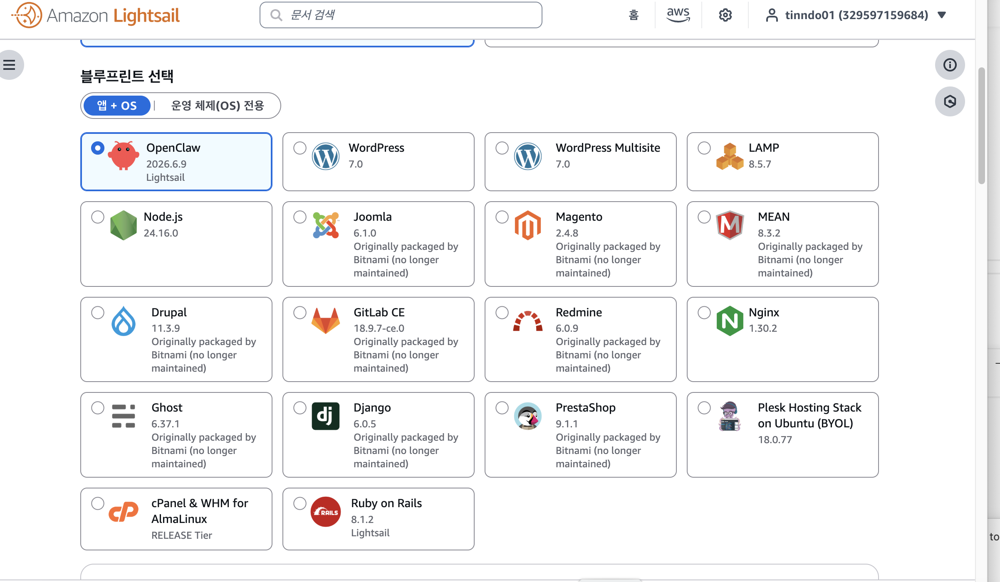
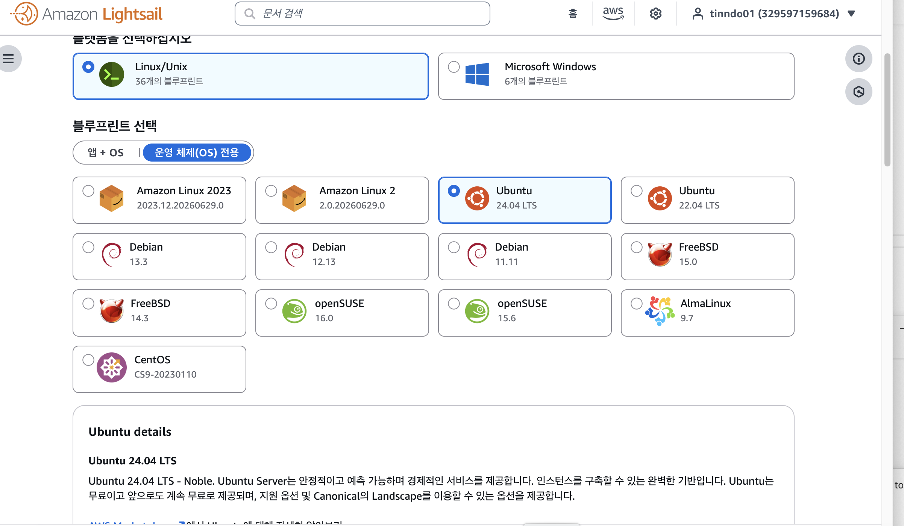
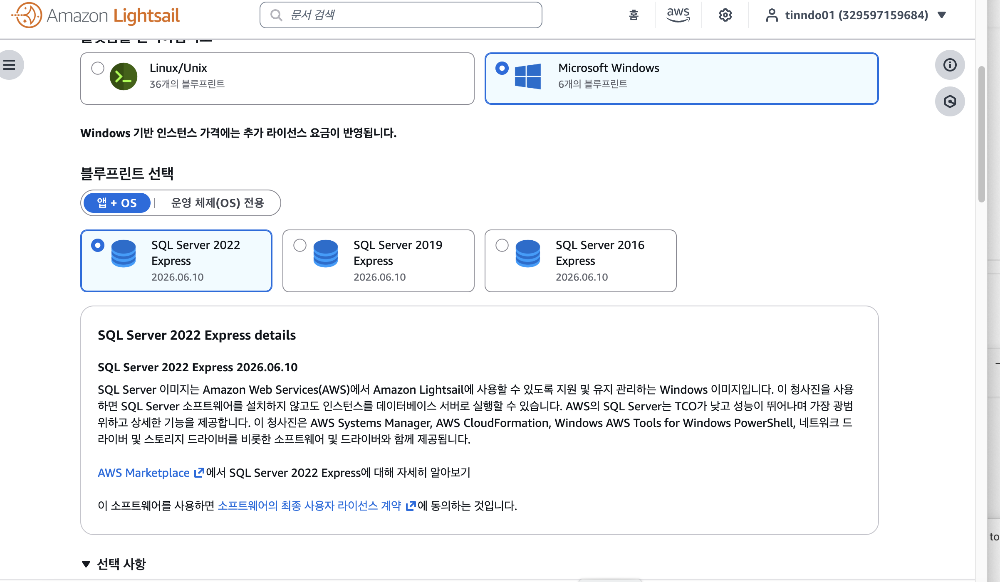
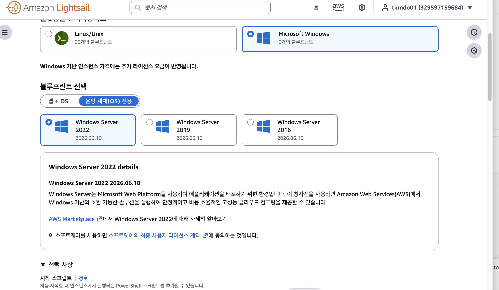

# 블루프린트

## 개념

직역하자면 '청사진'. 시아노타입 기법으로 복제하여 청색을 띄는 도면을 칭하던 말.

현재는 넓은 범위에서 기획, 설계도 등을 칭하는 용어로 사용됨.

IT분야 : 미리 정형화에 둔 실행 가능한 시스템 설계도나 템플릿

AWS Lightsail에서 인스턴스 생성 시, 플랫폼 선택 후 블루프린트를 선택한다.

이 블루프린트는?

**가상 서버에 가동할 OS 또는 애플리케이션이 이미 설치된 환경의 사전 구성된 이미지(템플릿)**

## 특징

앱+OS 혹은 OS전용의 두 부류 중 하나를 선택

리눅스 계열

윈도우 계열

> Lightsail provides several options for you to create your virtual private server. This topic helps you decide which operating system (OS), application, or development stack is right for your project. We organized the applications by functional area (such as CMS and ecommerce).
>
> 출처 : [AWS 공식 문서](https://docs.aws.amazon.com/lightsail/latest/userguide/compare-options-choose-lightsail-instance-image.html)

## 유사한 다른 예시

클라우드 플랫폼 Microsoft Azure에 Azure Blueprints라는 서비스 존재. 가상컴퓨터, 보안 정책, 네트워크 설정 등을 하나의 템플릿 패키지로 묶어 서버를 똑같이 찍어낸다.

가상화 솔루션 VMware에서도 서버 인프라 구성을 자동화하기 위한 템플릿 단위를 Infra(structure) Blueprint라고 부름.

파이선 웹 개발 프레임워크인 Flask에서 블루프린트라고 명명된 도구 있음.

기타 클라우드 자동화(IaC)에서 인프라를 코드로 구축하는 도구나 데이터 파이프라인 체계에서도 표준화된 레이아웃 템플릿을 블루프린트라고 부른다.

## 기타
lightsail에서와 같은 상황에서는 '이미지'나 '템플릿'으로도 명명될 수 있다.

실제 다른 클라우스 서비스에서 그렇게 많이 불림.
